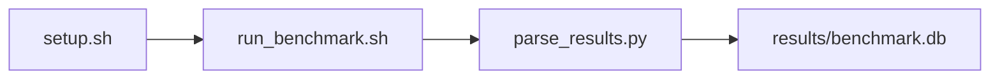

# ROCm System Validation (clocks, temp, etc.) Benchmark

[](LICENSE)
[](.github/workflows/ci.yml)

Target: Ubuntu 24.04 · AMD · see Hardware Requirements. This is a host benchmark, not a laptop `pip install` project.

## Quick Start

```bash
git clone https://github.com/garys-gpu-benchmarks/102-sys-bench-amd-rocm-health-validation-ubu2404.git
cd 102-sys-bench-amd-rocm-health-validation-ubu2404
sudo bash setup.sh --assume-yes
bash run_benchmark.sh --profile smoke --validate
```
Results are written to `results/benchmark.db` and `results/summary.json`.

This workload is executed on the validation host after the repository is copied there. `setup.sh` and `run_benchmark.sh` do not open an outbound SSH session.

Prerequisites: Ubuntu 24.04; AMD; Python 3.12.3; root or sudo for `setup.sh`. Framework: Bash, SQLite, Python, PyYAML, ROCm, rocm-smi, amd-smi, rocminfo. This is a host benchmark, not a laptop `pip install` project.



## 1. Overview

Takes one ROCm health snapshot from dmesg, rocm-smi, amd-smi, and rocminfo. Yaml pcie_check, clock_check, temperature_check, power_check, ecc_check, ras_check, firmware_version_check, hsa_agent_check, queue_check, and dmesg_check are documented; the collector always records dmesg faults, junction temp, HSA agent count, PCIe width/speed, and queue count. output_format: csv Sweep dimensions: pcie_check, clock_check, temperature_check, power_check, ecc_check, ras_check, firmware_version_check, hsa_agent_check.

## 2. What It Validates

- Validates a single telemetry snapshot. ECC/RAS/clock yaml flags are not implemented as separate probes
- #1: dmesg GPU fault count (dmesg_gpu_fault_count); is present and physically sensible.
- #2: GPU temperature (gpu_temperature_c); is present and physically sensible.
- #3: PCIe link width (pcie_link_width_lanes); is present and physically sensible.
- #4: PCIe link speed (pcie_link_speed_gt_s); is present and physically sensible.
- #5: HSA agents visible (hsa_agents_visible_count) is present and physically sensible.

## 3. Metrics Captured

- **#1: dmesg GPU fault count** — stored as `dmesg_gpu_fault_count`.
- **#2: GPU temperature** — stored as `gpu_temperature_c`.
- **#3: PCIe link width** — stored as `pcie_link_width_lanes`.
- **#4: PCIe link speed** — stored as `pcie_link_speed_gt_s`.
- **#5: HSA agents visible** — stored as `hsa_agents_visible_count`.

## 4. Hardware Requirements

### Supported environment

- OS: Ubuntu 24.04
- GPU vendor: AMD
- Framework family: Bash, SQLite, Python, PyYAML, ROCm, rocm-smi, amd-smi, rocminfo
- Python: Python 3.12.3

### Reference validation environment

The tables below describe the machine used to generate the reference results. They are not a requirement that every user buy that exact cloud instance.

### System

Ubuntu 24.04 / AMD / Bash, SQLite, Python, PyYAML, ROCm, rocm-smi, amd-smi, rocminfo

### GPU

Ubuntu 24.04 / AMD / Bash, SQLite, Python, PyYAML, ROCm, rocm-smi, amd-smi, rocminfo

## 5. Software Requirements

| Component | Version |
|---|---|
| OS | Ubuntu 24.04 |
| Kernel | kernel 6.8.0 |
| Python | Python 3.12.3 |
| ROCm | ROCm 7.2.1 |
| rocBLAS | N/A - rocBLAS not used |

Takes one ROCm health snapshot from dmesg, rocm-smi, amd-smi, and rocminfo. Yaml pcie_check, clock_check, temperature_check, power_check, ecc_check, ras_check, firmware_version_check, hsa_agent_check, queue_check, and dmesg_check are documented; the collector always records dmesg faults, junction temp, HSA agent count, PCIe width/speed, and queue count. output_format: csv

## 6. Installation

```bash
Run dmesg, rocm-smi --showtemp --showbus --showclocks --showpower, amd-smi metric, and rocminfo
```

## 7. Running the Benchmark

```bash
Run dmesg, rocm-smi --showtemp --showbus --showclocks --showpower, amd-smi metric, and rocminfo
```

**Validating results separately:**

```bash
export BENCHMARK_PYTHON=/usr/bin/python3.13  # optional
python3 -m venv .venv
source ".venv/bin/activate"
".venv/bin/python" scripts/validate_results.py
```

## 8. Output

### `results/benchmark.db` (SQLite)

CSV aggregate plus dmesg.txt

sample_index,status,dmesg_gpu_fault_count,gpu_temperature_c,hsa_agents_visible_count,pcie_link_width_lanes,pcie_link_speed_gt_s,queues_available_count,error_message
0,ok,0,40,1,16,32,1,

```bash
Run dmesg, rocm-smi --showtemp --showbus --showclocks --showpower, amd-smi metric, and rocminfo
```

### `results/summary.json`

Consolidated metrics from the most recent run — suitable for CI artifact upload or dashboard ingestion.

### `results/raw/<timestamp>.txt`

CSV aggregate plus dmesg.txt

sample_index,status,dmesg_gpu_fault_count,gpu_temperature_c,hsa_agents_visible_count,pcie_link_width_lanes,pcie_link_speed_gt_s,queues_available_count,error_message
0,ok,0,40,1,16,32,1,

## 9. Baselines / Thresholds

Expected ranges and gates live in `config/benchmark_config.yaml` under `baselines:` or `thresholds:`. To update them, edit that file — never edit validation code directly.

## 10. Troubleshooting

**`setup.sh` missing collector**
Create cannot finish without `scripts/collect_workload.py`.

**`self_check` overlay rewritten**
Do not overwrite files listed in `results/overlay_lock.json`.

**Remote SSH drop during setup**
Reconnect and resume `bash setup.sh --assume-yes`. Do not wipe `.venv` or `.cache`.

## 11. NVIDIA H100 Coding Differences

Primary target is AMD ROCm. NVIDIA notes in this section are reference only and are not the execution path.

## Repository layout

```text
.
├── setup.sh
├── run_benchmark.sh
├── benchmark_specification.json
├── config/
├── scripts/
├── src/
├── tests/
├── docs/
├── results/
└── LICENSE
```
